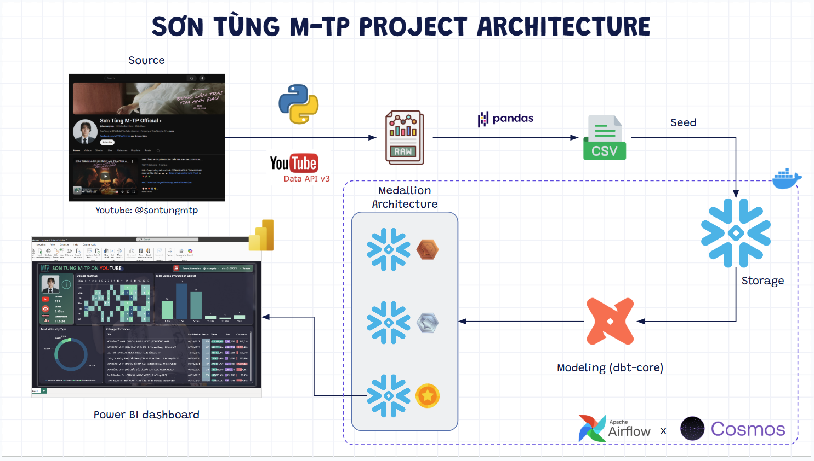
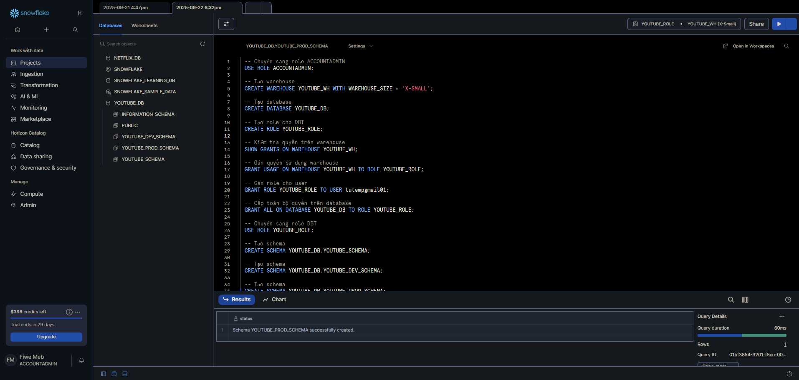
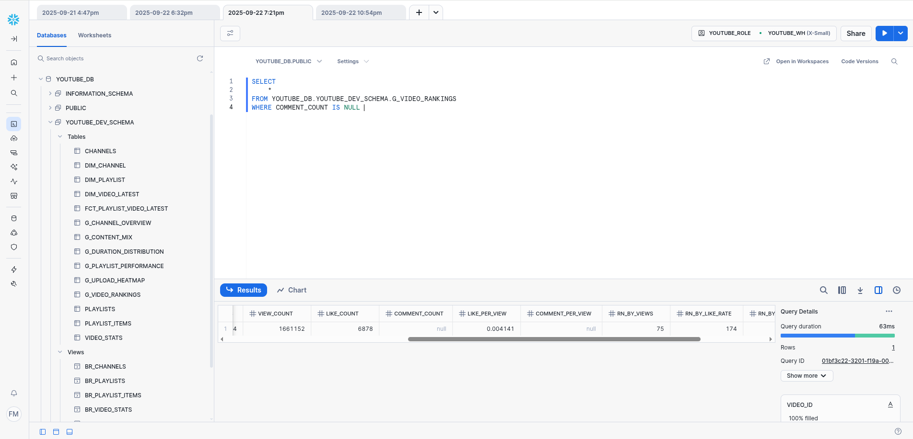
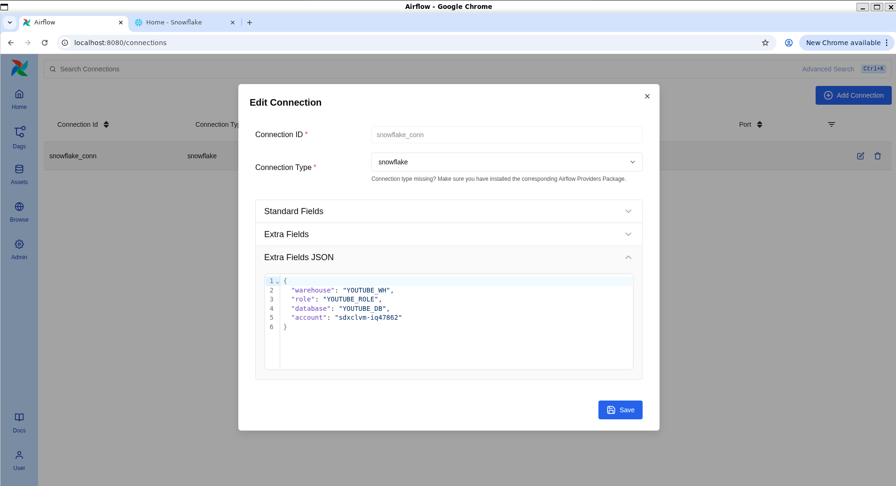
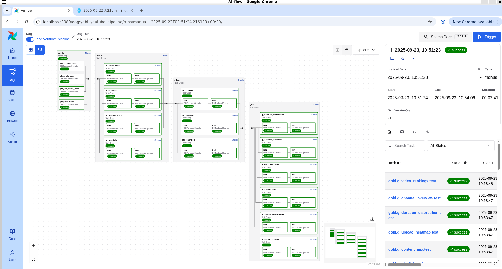
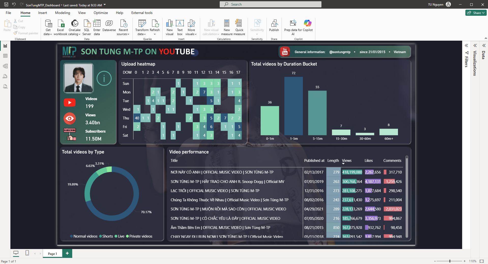

# 🎬 Son Tung MTP YouTube Analytics

Dự án phân tích kênh **Sơn Tùng MTP Official** trên YouTube với pipeline end-to-end:
- **YouTube API** → Crawl dữ liệu (video, playlist, stats)
- **Snowflake** → Lưu trữ data warehouse
- **dbt** → Chuyển đổi dữ liệu (Bronze → Silver → Gold)
- **Airflow (Cosmos/Astronomer)** → Orchestrate pipeline
- **Power BI** → Trực quan hoá dashboard

Kiến trúc dự án: 



---

## 📂 Cấu trúc repo

```

son-tung-mtp-analytics/
├── README.md                # Hướng dẫn sử dụng (file này)
├── pyproject.toml           # Config Python project
├── uv.lock                  # Lock file dependencies
│
├── imgs/                    # Hình minh hoạ (setup & dashboard)
├── logs/                    # Logs chung
│
├── python-get-data/         # Crawl dữ liệu YouTube API
│   ├── get-data.ipynb
│   └── data/\*.csv
│
├── snowflake-create-wh/     # Script khởi tạo Snowflake
│   ├── create-wh.sql
│   └── snowflake-account.txt
│
├── power-bi-dashboard/      # Dashboard Power BI
│   ├── SonTungMTP\_Dashboard.pbix
│   └── assets
│
├── dbt\_youtube/             # Dự án dbt chính
│   ├── models/              # Bronze / Silver / Gold
│   ├── seeds/               # Seed data
│   ├── snapshots/           # Snapshots
│   ├── macros/              # Macros
│   ├── tests/               # Tests
│   ├── dbt\_project.yml
│   └── packages.yml
│
└── dbt\_youtube\_dag/         # Airflow DAG cho dbt
├── dags/                # DAG (Cosmos)
├── requirements.txt
├── Dockerfile
└── astro project files

````

---

## 🛠️ Công nghệ sử dụng
- **Ngôn ngữ & môi trường**: Python 3.x, uv (Python package manager), Jupyter Notebook  
- **Data ingestion**: YouTube Data API v3, `google-api-python-client`, `pandas`  
- **Data warehouse**: Snowflake (Warehouse, Database, Schema)  
- **Data transformation**: dbt Core, dbt-snowflake, dbt-utils  
- **Orchestration**: Apache Airflow, Astronomer CLI, Cosmos (dbt + Airflow integration)  
- **Visualization**: Power BI Desktop / Power BI Service  
- **CI/CD & Environment**: Docker, Astronomer Runtime, `.env` secrets  
- **Version control**: GitHub  

---

## ⚙️ Chuẩn bị môi trường

### 1. Lấy API Key
Tạo API key tại: [YouTube Data API v3](https://developers.google.com/youtube/v3/getting-started#example-1)

Tạo file `.env` ở thư mục gốc:
```bash
YOUTUBE_API_KEY=YOUR_API_KEY

SNOWFLAKE_ACCOUNT=xxxx-xxxx
SNOWFLAKE_USER=....
SNOWFLAKE_PASSWORD=....
SNOWFLAKE_ROLE=....
SNOWFLAKE_WAREHOUSE=....
SNOWFLAKE_DATABASE=....
SNOWFLAKE_SCHEMA=....
````

---

### 2. Tạo venv và cài dependencies

```bash
uv venv
source .venv/bin/activate

uv add dbt-core dbt-snowflake
uv add pandas google-api-python-client google-auth-oauthlib ipykernel python-dotenv
```

---

### 3. Chuẩn bị Snowflake



Chạy script tạo warehouse/database/schema:

```bash
cd snowflake-create-wh
# Sửa create-wh.sql theo account của bạn, rồi chạy trên Snowflake UI/CLI
```

---

### 4. Crawl dữ liệu YouTube

```bash
cd python-get-data
jupyter notebook get-data.ipynb
```

Xuất CSV → sẽ được sử dụng làm seed trong dbt.

---

### 5. Chạy dbt



```bash
cd dbt_youtube

# Cài package dbt_utils
dbt deps

# Nạp seed
dbt seed --profiles-dir .

# Chạy models
dbt run --profiles-dir .

# Test
dbt test --profiles-dir .

# Snapshot
dbt snapshot --profiles-dir .
```

> Nếu cần docs:

```bash
dbt docs generate --profiles-dir .
dbt docs serve --profiles-dir .
```

---

### 6. Orchestrate bằng Airflow (Astronomer)

Cài Astronomer CLI:

```bash
curl -sSL https://install.astronomer.io | sudo bash
astro version
```

Khởi tạo project:

```bash
mkdir dbt_youtube_dag && cd dbt_youtube_dag
astro dev init
```

Trong `requirements.txt`:

```
astronomer-cosmos
apache-airflow-providers-snowflake
```

Khởi động Airflow:

```bash
astro dev start
```

UI: [http://localhost:8080](http://localhost:8080)

> Lưu ý: Airflow 3.0+ dùng `schedule` thay cho `schedule_interval`.






---

### 7. Dashboard Power BI

Dưới đây là báo cáo lấy từ các bảng `gold`, xem link dashboard live [Ở ĐÂY!](https://app.powerbi.com/view?r=eyJrIjoiMzA3MGIyNTYtMjk2OC00NmJjLWExODUtNDhmYTM0YzdmZmM5IiwidCI6IjM3MGZiM2I4LTMzMDYtNDg5MC05MDYzLWNjMDhiZTc4ODI1NyIsImMiOjEwfQ%3D%3D)



Mở file:

```
power-bi-dashboard/SonTungMTP_Dashboard.pbix
```

Kết nối Snowflake và chọn các bảng **gold** và vẽ báo cáo:

* g\_channel\_overview
* g\_video\_rankings
* g\_content\_mix
* g\_playlist\_performance
* g\_upload\_heatmap
* g\_duration\_distribution

---

## 🏗️ Kiến trúc tổng quan

1. **Crawl dữ liệu** từ YouTube API → CSV
2. **Load vào Snowflake** (seed / staging)
3. **Transform với dbt** (bronze → silver → gold)
4. **Orchestrate với Airflow** (Cosmos DAG)
5. **Visualize bằng Power BI**

---

## 📸 Demo

Xem ảnh trong thư mục [`imgs/`](./imgs)

* Kết nối Snowflake
* Run dbt thành công
* DAG Cosmos
* Dashboard Power BI

---

---

## 📖 Documentation & References

Trong quá trình xây dựng dự án, mình tham khảo và sử dụng các tài liệu chính thức sau:

- **YouTube Data API v3**  
  [https://developers.google.com/youtube/v3](https://developers.google.com/youtube/v3)

- **Snowflake Documentation**  
  [https://docs.snowflake.com](https://docs.snowflake.com)

- **dbt Core Documentation**  
  [https://docs.getdbt.com](https://docs.getdbt.com)

- **dbt-utils Package**  
  [https://hub.getdbt.com/dbt-labs/dbt_utils/latest](https://hub.getdbt.com/dbt-labs/dbt_utils/latest)

- **Apache Airflow Documentation**  
  [https://airflow.apache.org/docs](https://airflow.apache.org/docs)

- **Astronomer Cosmos (dbt + Airflow)**  
  [https://cosmos.astronomer.io](https://cosmos.astronomer.io)

- **Power BI Documentation**  
  [https://learn.microsoft.com/power-bi](https://learn.microsoft.com/power-bi)

---

## 📜 License

[MIT](/LICENSE)

---

## 📬 Liên hệ

Được thực hiện bởi `@tunguyenn99` Xóm Data.  
👉 Tham gia tại: [facebook.com/groups/xomdata](https://facebook.com/groups/xomdata)
